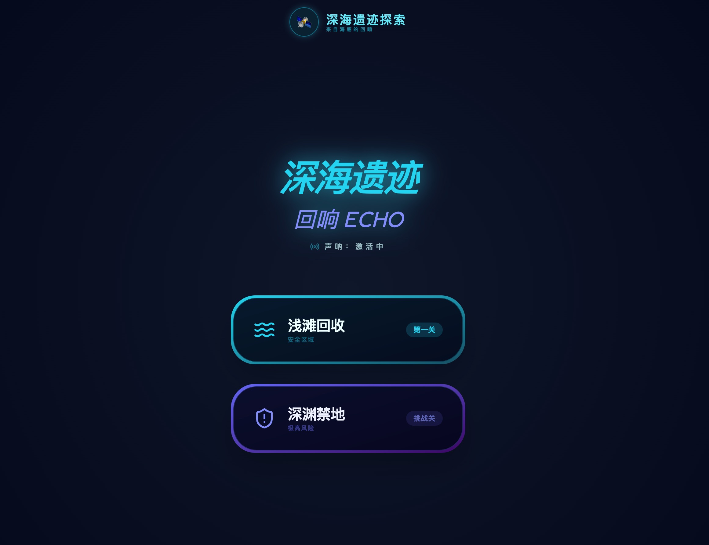
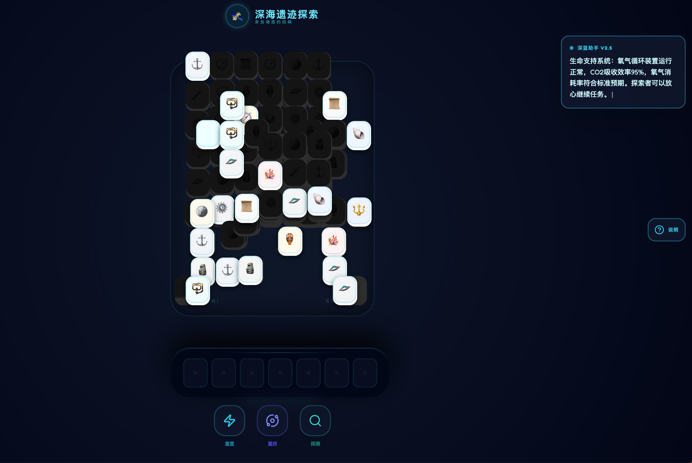

# 🌊 深海遗迹：回响

<div align="center">


一款神秘的深海主题三消瓦片消除游戏。在这个充满挑战的益智冒险中，从海底回收古老的遗迹。

**【该项目仅用于学习和娱乐】**

### 🎮 [在线演示](https://sea-le-sea.netlify.app/)

</div>

---

## 📸 游戏截图

<div align="center">

### 主页面


### 游戏界面


</div>

---

### ✨ 游戏特色

- 🎮 **经典三消玩法**：点击可点击的瓦片，将其移动到底部槽位，三个相同的瓦片会自动消除
- 🌊 **深海主题**：14 种不同的深海遗迹，包括古董陶罐、发光珍珠、黄金罗盘等
- 🤖 **AI 助手**：集成 Google Gemini AI，提供幽默的游戏解说和提示
- 🎯 **双难度模式**：
  - **第一关（教学关）**：约 15 片瓦片，简单的 3 层堆叠
  - **第二关（地狱关）**：约 180 片瓦片，复杂的"羊了个羊"式布局
- 🎨 **精美 UI**：使用 Tailwind CSS 和 Lucide React 图标，现代化的深海风格界面
- ⚡ **流畅动画**：线性过渡动画，避免跳跃感，提供流畅的游戏体验

### 🎯 游戏规则

1. **目标**：消除所有瓦片
2. **操作**：点击可点击的瓦片（未被上层瓦片压住的瓦片）
3. **消除**：底部槽位最多容纳 7 个瓦片，三个相同的瓦片会自动消除
4. **失败**：槽位被填满且无法消除时游戏失败
5. **特殊布局**：
   - 左右两侧的长条堆：只有最上层的瓦片可点击
   - 中央塔：严格的层级判定，上层瓦片会压住下层瓦片

### 🚀 快速开始

#### 前置要求

- Node.js 16+
- npm 或 yarn

#### 安装

```bash
# 克隆仓库
git clone https://github.com/yourusername/deep-sea-relic-hunter.git

# 进入项目目录
cd deep-sea-relic-hunter

# 安装依赖
npm install
```

#### 运行

```bash
# 开发模式
npm run dev

# 构建生产版本
npm run build

# 预览生产版本
npm run preview
```

访问 `http://localhost:3000` 开始游戏！

### 🛠️ 技术栈

- **前端框架**：React 19.2.3
- **开发语言**：TypeScript 5.8.2
- **构建工具**：Vite 6.2.0
- **样式方案**：Tailwind CSS
- **图标库**：Lucide React
- **打字机特效**：自定义 TypewriterText 组件
- **代码压缩**：Terser

### 📁 项目结构

```
deep-sea-relic-hunter/
├── components/          # React 组件
│   ├── Dock.tsx        # 底部槽位组件
│   ├── GameBoard.tsx   # 游戏棋盘组件
│   ├── GameHeader.tsx  # 游戏头部组件
│   ├── GameOverModal.tsx # 游戏结束弹窗
│   ├── HelpSidebar.tsx # 右侧帮助说明栏
│   ├── Tile.tsx        # 瓦片组件
│   └── TypewriterText.tsx # 打字机特效组件
├── services/           # 服务层
│   └── geminiService.ts # 环境话术服务（50条预设话术）
├── App.tsx             # 主应用组件
├── constants.tsx       # 游戏常量配置
├── types.ts            # TypeScript 类型定义
├── index.tsx           # 应用入口
├── index.html          # HTML 模板
├── vite.config.ts      # Vite 配置
└── package.json        # 项目依赖
```

### 🎮 游戏机制详解

#### 层级判定系统（俯视视角）

游戏使用严格的俯视遮挡检测：
- **核心思想**：从正上方往下看（俯视），只有视觉上完全可见的瓦片才能点击
- **瓦片尺寸**：宽 50px，高 60px
- **判定规则**：
  - 从上往下看，如果一个瓦片被任何更高层的瓦片遮挡，就不能点击
  - 遮挡判定：上层瓦片的投影与当前瓦片有重叠
  - 同层瓦片不互相遮挡
  - 只检查严格更高层（layer 值更大）的瓦片

#### 特殊布局

- **中央塔**：10 层高的复杂堆叠，每层 4-5 个瓦片
- **随机散落点**：10 个散落集群，每个集群 3 层
- **左右侧边槽**：各 15 个瓦片的长条堆，只有最上层可点击

### 🤖 深蓝助手功能

游戏内置智能助手"深蓝"，提供：
- **打字机特效**：逐字显示文本，停留 30 秒后自动删除并切换下一条
- **50 条环境话术**：包含深海探测、数据分析、系统状态等主题
- **幽默风格**：使用潜水术语和数据分析的语气，为游戏增添趣味性
- **自动循环**：话术自动切换，营造沉浸式深海探测氛围

### 🎨 视觉设计

- **深海渐变背景**：从深蓝到黑色的径向渐变
- **扫描线动画**：模拟声呐扫描效果
- **匹配闪光动画**：瓦片消除时的视觉反馈
- **流畅过渡**：使用线性过渡避免跳跃感
- **右侧帮助栏**：可展开/收起的功能说明，详细介绍重置、重排、探测三大功能
- **打字机特效**：深蓝助手的文字逐字显示，增强沉浸感

### 📝 开发说明

#### 添加新瓦片类型

在 `constants.tsx` 中添加新的瓦片定义：

```typescript
{ 
  id: 'new-item', 
  icon: '🎯', 
  name: '新遗迹', 
  color: 'bg-purple-50' 
}
```

#### 调整难度

修改 `App.tsx` 中的 `initGame` 函数：
- `totalTripletsCount`：控制瓦片总数
- 布局逻辑：调整中央塔、散落点、侧边槽的数量

### 🤝 贡献

欢迎提交 Issue 和 Pull Request！

### 📄 许可证

本项目采用 MIT 许可证。

### 🙏 致谢

- 游戏灵感来源于"羊了个羊"
- 图标由 Lucide React 提供
- 使用 Netlify 进行部署

---

<div align="center">

Made with ❤️ by Deep Sea Explorer

